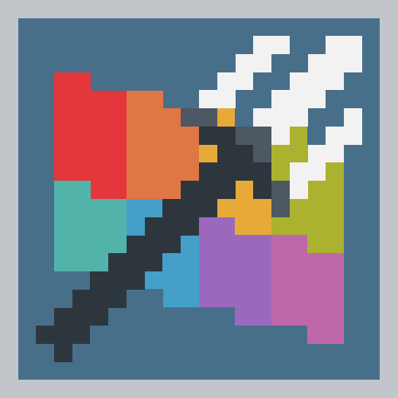
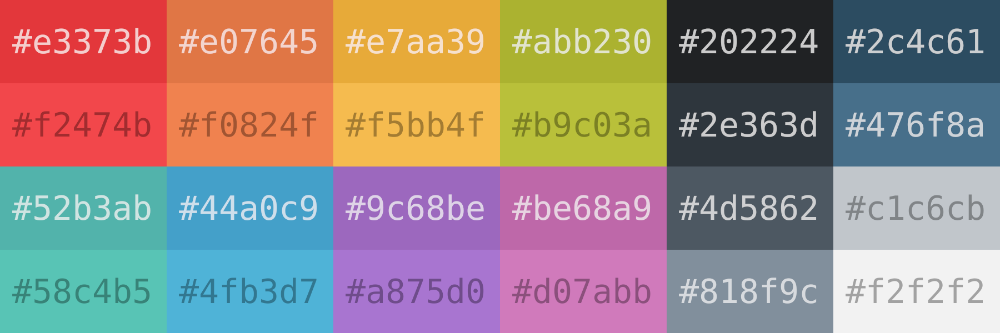
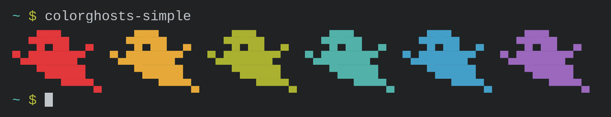
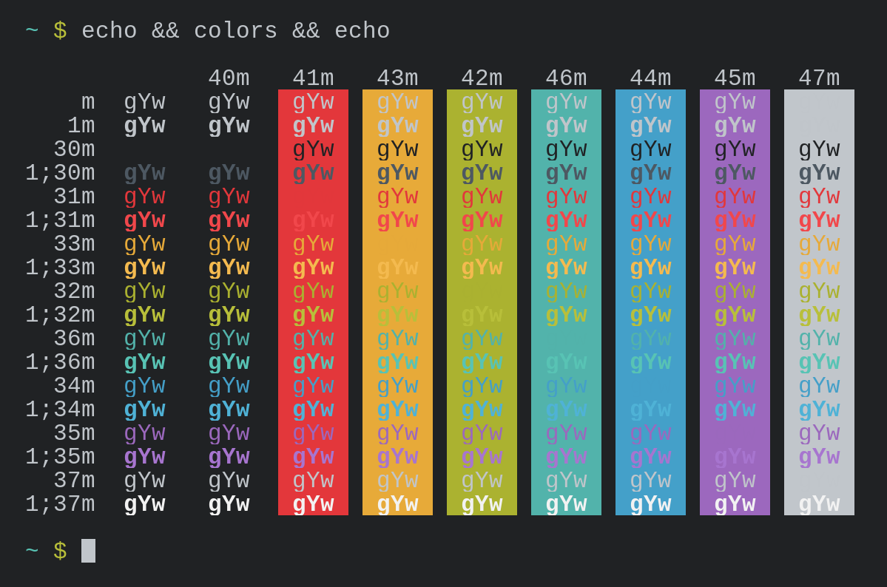
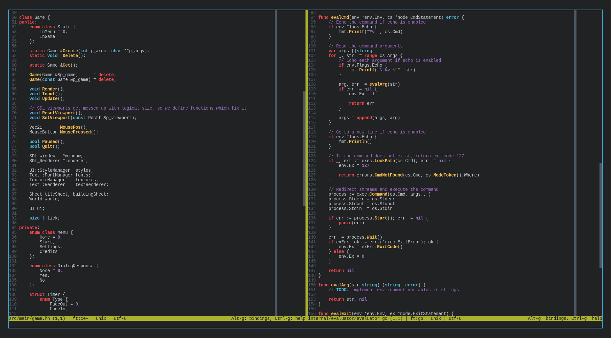

<h1>Trident palette</h1>

My simple 24-color palette

	
	
	
	   

## Table of contents
* [Introduction](#introduction)
* [Showcase](#showcase)
* [Files](#files)
* [Usage examples](#usage-examples)

## Introduction
A simple dark-mode designed 24-color palette inspired by [gruvbox](https://github.com/morhetz/gruvbox), made to not be too harsh on the eyes and to fit in with most other themes.

	<a href="./palette.png">The palette image</a> 
	

## Showcase

	 
	 
	 

## Usage examples
- Snash (my Go shell) [logo](https://github.com/LordOfTrident/snash/blob/main/res/logo.png), [thumbnail](https://github.com/LordOfTrident/snash/blob/main/res/thumbnail.png)
- [My profile README.md](https://github.com/LordOfTrident/LordOfTrident)
